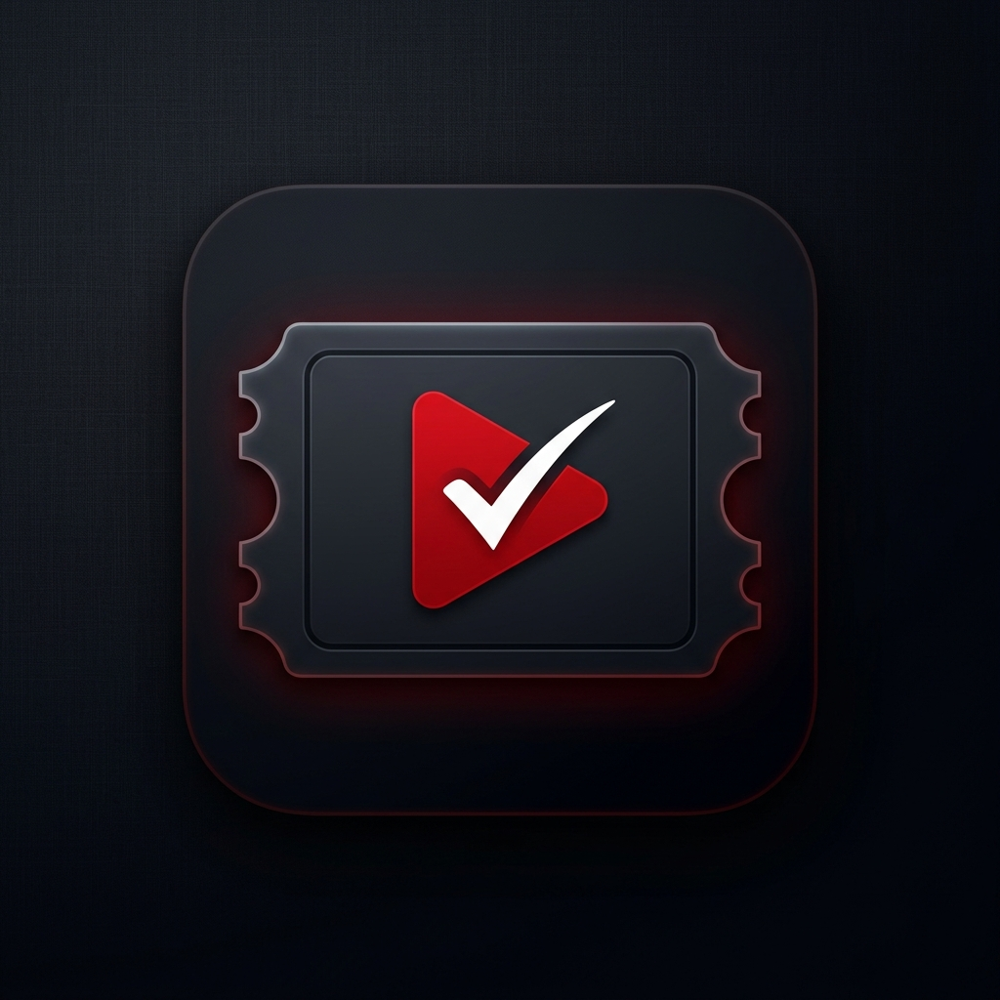

# AV's Bucket List 🍿

<div align="center">
  
  <h1>🚀 JUMPSTART CONTROL CENTER</h1>
  <p><i>A premium, production-grade personal media tracker with enterprise-level sync.</i></p>
  
  <p>
    <a href="#-quick-launch"><b>Quick Launch</b></a> •
    <a href="#-features"><b>Features</b></a> •
    <a href="#-development"><b>Tech Stack</b></a> •
    <a href="#-security"><b>Security</b></a>
  </p>
</div>

---

## ⚡ QUICK LAUNCH

To start the entire application suite (Frontend, Backend, and PWA Window) with automatic cleanup on exit:

1.  **Double-click `start_app.bat`** in the root directory.
2.  The application will launch in a dedicated **App Window**.
3.  **To Stop**: Simply close the App Window. The launcher will automatically kill all background processes (Vite & FastAPI).

---

## ✨ FEATURES

- **Multi-Source Data**: Unified metadata from TMDB, OMDB, AniList, and Jikan.
- **Smart Tracking**: Granular episode and season tracking for series and anime.
- **Production-Grade Sync**: 2-tier synchronization system (Local SQLite/IndexedDB <-> Google Apps Script Vault).
- **PWA Ready**: Install as a desktop or mobile app for offline access.
- **AI-Powered Stats**: Visualize your watching habits and trends.
- **Conflict Resolution**: Advanced merge strategies for multi-device sync.

## 🚀 Production Deployment

### Prerequisites

- **Backend**: Python 3.9+
- **Frontend**: Node.js 18+
- **Database**: SQLite (local)
- **Vault**: A Google Apps Script web app (see `google_apps_script.js`).

### 1. Environment Configuration

Create a `.env` file in the root directory:

```env
# Backend
GAS_URL=https://script.google.com/macros/s/.../exec
GAS_SECRET=your_vault_secret
TMDB_API_KEY=your_tmdb_key

# Frontend
VITE_GOOGLE_CLIENT_ID=your_google_oauth_client_id
VITE_BACKEND_URL=https://api.yourdomain.com
```

### 2. Backend Deployment (Docker/Gunicorn)

The backend is built with FastAPI. For production, use Gunicorn with Uvicorn workers:

```bash
cd backend
pip install -r requirements.txt
gunicorn main:app -w 4 -k uvicorn.workers.UvicornWorker -b 0.0.0.0:8000
```

### 3. Frontend Build & Deploy

```bash
npm install
npm run build
```

The `dist` folder will contain the optimized production build. Serve it using Nginx, Caddy, or any static host (Netlify, Vercel).

## 🛡️ Security Features

- **Rate Limiting**: Integrated backend middleware to prevent API abuse.
- **Secure Headers**: XSS, Frame Options, and CSP headers enforced.
- **Data Privacy**: No tracking, no third-party telemetry. Your data stays in your vault.

## 🛠️ Development

```bash
# Start development server
npm run dev

# Start backend (auto-reloads)
python backend/main.py
```

## 📜 License

MIT
